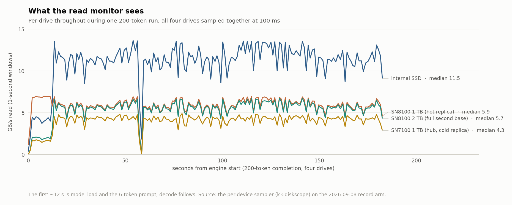

# ARGODRIVE

**Layout, balancer and instruments for running mixture-of-experts models from SSDs.**
When a model does not fit in RAM, every token waits on disk. ARGODRIVE decides where the
expert weights live across your drives, splits each read across them in proportion to
measured device speed, and shows you — in milliseconds, per drive, per phase — what the
engine is actually waiting for.

Three models, two engines, one 128 GB laptop.

## What it has done

| model | engine | baseline | best measured | gain |
|---|---|---|---|--:|
| DeepSeek V4.1-Flash Q4, 518 GB on disk | ds4 fork | **upstream ds4**, one drive: 16.50 / 10.44 (vs our one-drive) · 16.23 / 10.61 (vs our three-drive) | one drive, no replicas: **28.04 / 14.38** · three drives: **43.62 / 17.38** | **1.70× / 2.69×** |
| GLM-5.3, 744B | ds4 fork | our fork, one drive: 2.02 | four drives: **3.54** | **1.8×** |
| Kimi K3, 2.78T | deltafin fork | our fork, one drive: 0.55 | four drives: **0.96** | **1.8×** |

All on an M5 Max, 128 GB. Read the baselines carefully, because they are not the same kind of
number. The V4.1 row compares against the **pinned upstream ds4 binary** (`bd66c40`),
re-measured 2026-09-15 on the branch exactly as it ships, with a **byte-identical output
SHA-256 on every arm**. The one-drive and three-drive comparisons were separate interleaved
sessions, each with its own upstream control, which is why two baselines are quoted. The GLM and K3 rows are our own software scaling from one drive
to four, which is a storage result, not an engine comparison. GLM is 200-token generation;
K3 is the public 17-token prompt, a median of three runs at every rung. V4.1 is a 512-token
prompt with 200 generated, medians of interleaved pairs.

**The one-drive V4.1 column is the portable part, and it needs no replicas.** It is the
selective expert read alone: a 512-token chunk routes to 187 of 384 experts per layer, so the
stock layer-major sweep reads about twice what the model touches. Anyone with a single SSD
gets that. The three-drive column adds weighted split reads across internal + two SN8100s at
10:5:5 — that is what extra devices buy, and it is what the published branch supports.

Time to first token on a 512-token prompt, which is the question everyone asks next:
**31.5 s → 18.3 s on one drive → 11.7 s on three.**

## What the instruments show



*Per-drive throughput across one 200-token run, all four drives sampled together. The first
~12 s is model load and prompt; decode follows. (Kimi K3 record arm, 2026-09-08.)*

The view that matters most is not this one, though. It is read **latency**: V4.1 decode
averages 5.2 GB/s, about 19% of these drives' combined ceiling, and still gets faster when
you add a fourth drive. No throughput chart can explain that. Milliseconds per read can.

## How it works, in five lines

1. One device holds the complete expert set; the others hold usage-weighted replicas.
2. Each read is split across the devices that hold it, in proportion to measured device rate.
3. Both read paths dispatch by expected completion time, with shared in-flight counters.
4. During prefill, layer N+1 is staged while the GPU computes layer N.
5. Only the experts the router actually selected are read — for V4.1 at 512 tokens that is
   187 of 384 per layer, so the stock layer-major sweep was reading about twice what the
   model touches.

## Why more drives help when bandwidth is not the limit

A layer cannot start until **every** routed expert has arrived. So it costs the *maximum*
over its reads, not the sum. Adding a drive does not mainly add bandwidth — it makes each
slice of a split read smaller, so the slice that lands last lands sooner. That is why a
fourth drive moved peak throughput hardly at all and still bought +6.6% prefill and +2.9%
decode, and it is why aggregate GB/s is the wrong number to optimise.

## The engine branch

The V4.1 work lives in our fork of Salvatore Sanfilippo's ds4:

**[`argonautlabsai/ds4-argodrive` @ `argonaut-v41-benchmark`](https://github.com/argonautlabsai/ds4-argodrive/tree/argonaut-v41-benchmark)** — commit `18fc795`

**What is reproducible from these repos.** A fresh clone of that branch builds `ds4` and
`ds4-bench` on Apple silicon with the multi-source reader compiled in — not stubs. Verified
2026-09-15 from a clean clone. Reproducing the *number* additionally needs N byte-identical
replicas of the 518 GB model file on separate devices, which is a hardware precondition we
cannot hand you in a repo; the loader checks replica size, not content. A single-drive clone
runs correctly and simply sees no split.

## Download the Mac beta

[**Download ARGODRIVE for Apple silicon**](https://github.com/argonautlabsai/argodrive/releases/tag/v0.2.0-beta.3) · [**Installation and testing guide**](https://github.com/argonautlabsai/argodrive/blob/beta-20260914/docs/BETA-TESTING.md) · [**Beta source**](https://github.com/argonautlabsai/argodrive/tree/beta-20260914)

Open Live Hardware to check connected drives, memory and activity. Choose a folder of supported benchmark runs to inspect results and compare configurations. Report launch, drive-discovery or chart issues [on GitHub](https://github.com/argonautlabsai/argodrive/issues). Review any attachments for private paths and prompts before sharing.

This is a monitoring and saved-run analysis preview, not an automatic optimizer, and it does
not include model weights. The beta is ad-hoc signed and not notarized; see the testing guide
before installing. The guided test → tune → validate → save-settings workflow is the next
product milestone and is not yet in the downloadable app — see the
[streaming optimiser plan](docs/STREAMING-OPTIMIZER.md).

```sh
# Review saved runs without starting a hardware sampler
./argodrive run --reports-only --runs /path/to/arms
```

Open http://localhost:8130. Use Settings to validate or change the run folder. See the
[dashboard guide](docs/DASHBOARD.md) for metric definitions, or
[development setup](docs/BETA-DEVELOPMENT.md) for live collection. Python 3.10+ is required;
the UI has no runtime package dependencies. A self-contained Apple-silicon technical preview
can be built with [scripts/build-macos.py](scripts/build-macos.py); see
[Mac beta release instructions](docs/MAC-BETA-RELEASE.md).

## Model support in the local Beta 3 build

| Model family | Engine | Current scope |
|---|---|---|
| Kimi K3 | Deltafin | Recorded-run analysis and streaming evidence |
| GLM 5.3 | Argonaut ds4 fork | Recorded runs, candidate profiles and qualified campaign evidence |
| DeepSeek V4.1 Flash | Argodrive ds4 fork · Metal | Experimental four-drive profile and recorded qualification evidence |

The current V4.1 evidence is a single-machine qualification on an M5 Max with
the internal SSD plus three verified replicas, split 10:6:6:4 by measured read
speed, measured against the pinned upstream engine (`bd66c40`) on the internal
SSD alone. Both sides produce the same output SHA-256, so the comparison is
like-for-like rather than a storage-layout screen:

| 512 prompt / 200 generated | upstream, one drive | Argodrive, four drives |
| --- | ---: | ---: |
| prompt processing | 16.28 tok/s | 44.50 tok/s (2.7x) |
| generation | 10.04 tok/s | 16.27 tok/s (1.6x) |

The prompt-processing gain is the 2026-09-15 prefill work: prefill had been
reading every routed expert through the memory map of the primary file, so one
drive carried it, and the layer-major sweep read all 384 experts of each layer
where a 512-token prompt routes to 187. The generation gain is not that change;
it comes from decode replica streaming and a larger expert cache.

It is not a general speed guarantee, and the packaged app does not launch
inference automatically. The GLM fork's replica settings are not available in
the fresh upstream engine. See [V4.1 preparation and test
procedure](docs/DEEPSEEK41.md).

## Product direction

First, turn SSD calibration and model-specific streaming experiments into a
guided workflow on one Mac. Compare supported read methods, per-drive work
allocation, reader concurrency, prefetch and expert-cache budgets using real
inference runs. The dashboard is the interface for this workflow and its evidence.

Then extend the same model to multiple Macs, local and remote expert RAM caches,
and SSDs. Cluster management, RDMA and peer-cache execution are planned
capabilities, not implemented features.

See [the product direction and staged architecture](docs/PRODUCT-DIRECTION.md).

## Original research instruments

Measurement instruments for SSD-streamed mixture-of-experts inference. These
are the tools that found every gain in the ArgoDrive Deltafin benchmark
package; they are shared as they are — deltafin-specific, rough, and honest —
because the results are not credible without them. Paths, drive names and
role assignments are the ones used on the reference machine (a MacBook Pro
M5 Max with three Thunderbolt 5 NVMe enclosures); adapt `K3_DIR` and the
volume names to yours.

## What they show

Per-drive read throughput during one 200-token completion, all four drives
sampled together at 100 ms by `k3-diskscope`: first as a replay of the sampler's
record (the bars move as the drives did, at 8× speed), then reduced to one-second windows:

<picture>
  <source media="(prefers-color-scheme: dark)" srcset="https://raw.githubusercontent.com/argonautlabsai/argodrive/main/charts/drives-live-dark.svg">
  
</picture>

<picture>
  <source media="(prefers-color-scheme: dark)" srcset="https://raw.githubusercontent.com/argonautlabsai/argodrive/main/charts/read-timeline-dark.svg">
  
</picture>

The same run reduced to median and peak draw per drive, against each drive's
standalone ceiling measured with `k3-drive-ceiling.py` while the engine was
idle — every drive at 88–100% of its own ceiling, which is why the read barrier
rather than total bandwidth sets the decode speed:

<picture>
  <source media="(prefers-color-scheme: dark)" srcset="https://raw.githubusercontent.com/argonautlabsai/argodrive/main/charts/drive-draw-dark.svg">
  
</picture>

Both charts are produced from the sampler CSV and the ceiling tool's output by
the chart script in the benchmark package
([`argonautlabsai/deltafin`](https://github.com/argonautlabsai/deltafin/tree/main/k3-public-bench/results/charts)).

| directory | tool | what it does |
|---|---|---|
| `monitor/` | `k3-diskscope.c` | 100 ms sampler of per-device read bytes and ops, RAM, CPU and GPU counters, to CSV. `cc -O2 -o k3-diskscope k3-diskscope.c -framework IOKit -framework CoreFoundation` |
| `monitor/` | `k3-live.py` | local web dashboard on port 8130: live per-drive throughput, arm history with same-length deltas, by-layer barrier report from a per-read trace, CSV exports |
| `monitor/` | `app.js` (Monitor → Advanced) | milliseconds per read, reads in flight, duty cycle and read size per drive, from IOKit completed-read statistics. Throughput charts cannot explain why another drive helps when the workload uses 19% of the available bandwidth; a split read completes when its slowest slice does, and this view shows that slice shrinking |
| `monitor/` | `k3-memsample.sh` | one line per second of macOS memory truth (used / available / wired / swap) |
| `harness/` | `k3-arm.sh`, `k3-arm-inner.sh`, `k3-measure.sh` | one measured arm: the configuration of record as environment, cold start enforced, swap guard, device map recorded, sampler and memory log per arm, text-identity check |
| `harness/` | `k3-pressure.c` | memory-pressure step before an arm (records what preceded each measurement) |
| `harness/` | `k3-stdbench-table.py` | inclusive / steady / first-token table from arm logs; derived prompt-processing rate |
| `trace/` | `k3-trace-gaps.py` | per-barrier attribution from the engine's read trace: which device landed last, its gap behind the next-to-last, by demand-vs-prefetch, barrier width and layer |
| `drives/` | `k3-drive-ceiling.py`, `k3-ceiling-run.sh` | standalone read ceiling of an expert directory (whole files, no page cache, N in flight), per drive and per queue depth |
| `drives/` | `k3-drive-map.py`, `k3-drive-names.example.json` | which physical drive is which — model, serial, whole-disk, bus, direct port or hub — and drift against the last snapshot; run after any replug |
| `placement/` | `k3-regen-manifests.py` | regenerate and verify placement manifests from the live directories |
| `placement/` | `k3-stage-wider-bands.py` | widen replica bands by traffic share from a usage trace, with a manifest and rollback script per band |
| `monitor/` / `scripts/` | `ds41_placement.py` / `ds41-placement.py` | parse DeepSeek router traces, map GGUF expert spans, generate Deltafin-style usage-weighted manifests, and qualify matched A/B records |
| `scripts/` | `kimi-deltafin-profile.py` | print the Deltafin Kimi replica/ETA candidate and verify path filesystem identities without changing model data |

## How they were used

Every published number came from one `k3-arm.sh` invocation: it exports the
configuration of record, refuses to run warm or under swap, records the device
map, starts the sampler and the memory log, runs the engine once, and checks
the output against the text of record. Arms were run one at a time with the
dashboard server stopped (its sampler costs about one percent). Read traces
(`K3_READ_TRACE=<file>`) were taken on separate arms and analysed with
`k3-trace-gaps.py` and the dashboard's by-layer view, never used for speed
figures. Drive ceilings were measured with the engine idle.

## Current implementation boundary

The local **0.2.0-beta.3** build adds an experimental Cluster tab with saved M1
qualification evidence, plus native one-link expert transfer tools. A real
Thunderbolt run verified 1,000 requests against a 200-record K3 sample at
1.30 GB/s of transfer time. This is a transport result, not a decode speedup.
Multipath, remote RAM caching, RDMA and ds4 integration remain unimplemented.
See [wire/README.md](wire/README.md) and [wire/BENCH.md](wire/BENCH.md).

The packaged app monitors and compares measurements. The separate research
scripts can test reads, run configured benchmark arms and prepare expert replicas;
many still assume the reference machine's paths and deltafin's `K3_*` settings.
They need adaptation before use on another setup.

The engine performs the actual expert reads and scheduling. The generated
DeepSeek manifests are advisory until the ds4 fork explicitly consumes them;
the current three-drive runner still uses its explicit split-reader settings.
ARGODRIVE's next step is to select, test and export settings through versioned engine adapters.
An integrated automatic tuner and runtime adaptation to changing load are not
implemented yet. A standalone SSD result alone does not establish the fastest
inference configuration.

## Development acknowledgements

Claude, ChatGPT and OpenAI Codex assisted with development and review. Their use is acknowledged here; private chat histories are not part of this repository. Performance and correctness claims are supported by the stated tests and measurements, with limitations recorded separately.

## Licence

MIT.
