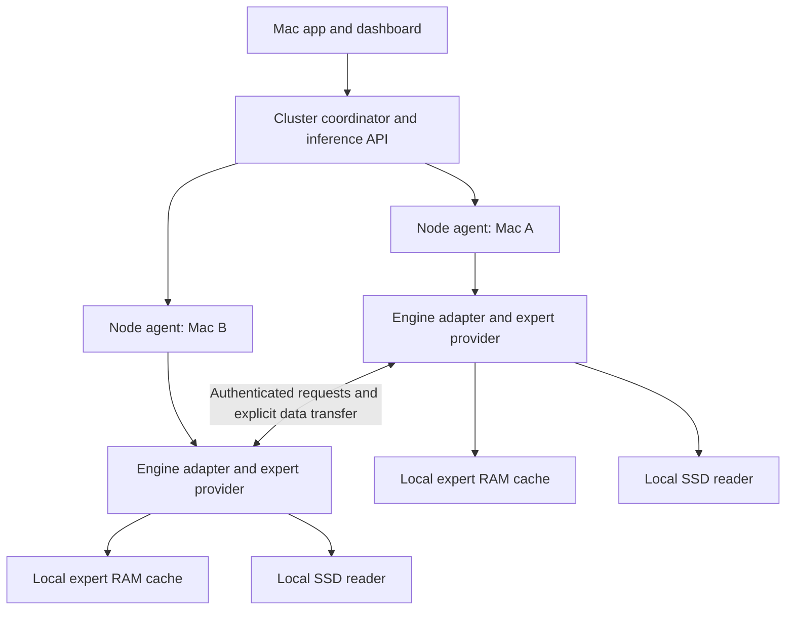

# ARGODRIVE: distributed inference across Macs, memory and SSDs

Product direction recorded 10 September 2026 following the owner's clarification.
This describes the target architecture. The current 0.2 preview implements local
monitoring and saved-run analysis; it has no cluster, peer-cache or RDMA runtime.

## Product promise

Run large models across the Macs and drives you already own, with automatic
placement and clear evidence of what limits performance.

The dashboard is the future control surface for that system. Storage scheduling,
expert placement and memory reuse are core product capabilities. The research
instruments remain valuable as the means of validating the scheduler.

The proposed differentiator is coordinated placement across local RAM, peer RAM
and multiple SSDs for mixture-of-experts inference. Whether it outperforms other
approaches must be established with matched workloads and hardware. There is no
claim here that Exo lacks an equivalent capability or that ARGODRIVE already has it.

## What Exo establishes

Exo documents automatic discovery, topology-aware placement, MLX distributed
inference, tensor parallelism, Thunderbolt RDMA, a Mac app and a cluster/chat UI.
These are useful reference points for the eventual experience. Its published
speedups are specific to its configurations, not forecasts for ARGODRIVE.
[Exo repository](https://github.com/exo-explore/exo)

Build engine adapters so an Exo/MLX integration can be evaluated alongside the
existing ds4/deltafin work. Integrating an orchestrator would not automatically
add remote expert fetching to ds4: that requires an engine-level data path.
Prefer an independently benchmarked adapter over committing now to a wholesale
fork or rewrite. Compatibility and code reuse require a separate source audit.

## Constraints that change the design

Apple documents Thunderbolt RDMA on Apple-silicon Macs with Thunderbolt 5 from
macOS 26.2. Its documented Verbs implementation supports send/receive only, with
messages up to 16,773,120 bytes. A peer service must participate in transfers;
we cannot design around one-sided reads of arbitrary remote memory. Larger
expert payloads need chunking and completion tracking. Activation or weight
transport still has finite link bandwidth.
[Apple TN3205](https://developer.apple.com/documentation/technotes/tn3205-low-latency-communication-with-rdma-over-thunderbolt)

MLX's JACCL backend currently requires a fully connected direct Thunderbolt mesh.
Its ring backend uses TCP and restricts arbitrary-peer send/receive. Those are
backend-specific requirements, not a universal limit on every custom transport.
[MLX distributed communication](https://ml-explore.github.io/mlx/build/html/usage/distributed.html)

The placement planner must represent individual ports, links and shared paths.
A Mac-to-Mac cable can consume a port currently used by an SSD enclosure. Test
network and SSD traffic concurrently; summing their independent peak rates is
not a valid capacity model. Discovery must distinguish supported, enabled,
connected and successfully measured RDMA states.

## Target product structure

| Area | User's job | Evolution from the current preview |
| --- | --- | --- |
| Overview | See available capacity and current workloads | Add selected cluster, active model instances, node health and request performance |
| Models | Choose, place and serve a model | Add inventory, compatible engines, placement preview, memory budget, start/stop and API endpoint |
| Cluster | Understand and manage connected Macs | Add paired nodes, roles, port/link topology, measured bandwidth/latency and health |
| Memory & storage | Control where expert weights live | Elevate expert placement, local/remote RAM budgets, SSD replicas, cache activity and migration |
| Performance | Understand and reproduce results | Combine current Runs, Compare, Live and advanced Diagnostics with cluster/request context |
| Settings | Manage installation and trust | Add node pairing, access control, cluster membership and backend capabilities |

Keep the implemented navigation while its functions are useful. Add these areas
as real backend capabilities arrive. Do not fill the product with inactive
controls or show invented nodes, cache hits or link rates. The previous decision
to remove crowded research tabs does not remove the scheduler from the roadmap.

## Architecture boundaries

- **UI / Mac shell:** discoverable workflows, onboarding, service lifecycle and
  packaging. Keep transport and weight buffers out of browser/Python UI code.
- **Coordinator:** authenticated membership, topology, reservations, model
  placement, request admission and metrics. Python is suitable for the first
  implementation; isolate it from the byte-transfer path.
- **Node agent:** stable node identity, inventory, memory budgets, health and
  versioned engine/transport capabilities. A single Mac is a one-node cluster.
- **Engine adapter:** ds4/deltafin first; investigate MLX/Exo separately. Expose
  expert requests and completions without assuming the engines share a format.
- **Native data path:** local cache, current SSD reader and a peer-cache transport
  behind a common asynchronous expert-provider contract. Preserve in-flight
  buffer ownership and GPU completion semantics.

Use a small explicit request protocol for a TCP correctness baseline and an RDMA
implementation behind the same contract. JACCL is an option for MLX distributed
compute, not automatically a general object-cache transport for ds4.

## Two distinct ways to use another Mac

1. **Fetch weights from peer RAM:** the requesting Mac executes the expert. This
   tests whether remote cache retrieval beats a local SSD miss on the critical
   path, including lookup, queueing, transfer and GPU-ready buffer handling.
2. **Execute the expert on the peer:** send activations to the Mac holding its
   weights and return results. This can reduce weight traffic but introduces
   distributed compute, remote GPU queues and aggregation. It needs a separate
   engine implementation and benchmark.

Neither approach guarantees a speedup. Select by measured completion cost under
load, not a fixed assumption that remote RAM always beats local SSD. Do not
initially race every source: speculative reads can double traffic and must have
a measured benefit and bounded cancellation cost.

## Expert-cache contract

Use an immutable content identity: model revision/hash, quantization and tensor
layout, layer/expert ID, byte range and checksum. Expert number alone is unsafe.
Keep KV cache request-local until an explicit state-transfer design exists.

Represent local residency separately from advertised peer availability. Reserve
OS, engine, KV, transport and in-flight buffers before allocating expert-cache
capacity. Deduplicate replicas when presenting unique resident bytes; sum actual
allocations only when presenting physical memory use.

Entries follow explicit loading, ready, in-flight, poisoned and evictable states.
A remote completion must validate length and identity before publication. Partial
reads, disconnects or stale peers must not expose a partly written expert to the
GPU. Hold transport/GPU references until completion; use generations or leases to
prevent reuse of an evicted buffer. Verify local fallback after peer failure.

## Build order and proof required

| Stage | Deliverable | Exit condition |
| --- | --- | --- |
| 1 | Node/capability schema and local-agent boundary | Existing single-Mac runs retain speed and correctness; every metric has node, engine, source and time identity |
| 2 | Two-Mac inventory and link qualification | Explicitly paired peers, reliable disconnect handling, measured end-to-end latency/bandwidth and concurrent SSD tests |
| 3 | Bounded peer RAM cache over a simple transport | One immutable expert fetched correctly; partial transfer and eviction tests pass; existing local fallback survives |
| 4 | RDMA peer-cache adapter and engine integration | Matched runs compare local SSD vs peer cache; p50/p95 token latency and total network/SSD bytes show the actual tradeoff |
| 5 | Adaptive cache placement | Demand-only local/remote hit rates, prefetch usefulness and complete-token speed demonstrate a repeatable benefit |
| 6 | Remote expert execution / broader distributed inference | Output validation, persistent-serving recovery, long generations and concurrent requests pass on two nodes before scaling |
| 7 | Multiple clusters | Separate membership, budgets and model instances; route requests between clusters before attempting cross-cluster token synchronisation |

The first prototype should use two Macs and one model. More nodes, arbitrary
networks and automatic failover across separate clusters compound the difficult
parts before the basic benefit is known. These are staged engineering milestones,
not dates or speed promises; effort estimates depend on the engine adapter audit.

## Metrics to make the product useful

Prioritise first-response latency, per-token latency p50/p95, per-request speed,
aggregate serving throughput and output validity. Keep these scopes distinct.

For each expert request, record selected source, useful bytes, speculative bytes,
queue delay, transfer completion and GPU-ready time. Track local RAM demand hits,
remote RAM demand hits, SSD demand misses, useful prefetches and late/wasted
prefetch separately. Profile frequency alone is not a cache hit.

For each link, show transport, capability status, measured bandwidth, latency,
in-flight work and disconnects. For each node, show reserved/allocated memory,
engine role and pressure. Use request/trace IDs and clock-domain metadata;
unsynchronised host clocks cannot support a trustworthy cross-host timeline.

## Immediate decision

Design the next backend boundary around node/engine/expert-provider identities,
then qualify a two-Mac peer-cache experiment. Retain the present dashboard as the
measurement foundation. Do not promote cluster or RDMA functionality in the app
until actual capability and end-to-end completion data are available.
